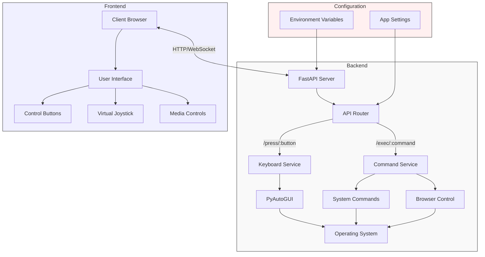

# Pointer - Remote Control Web App

Pointer is a web-based remote control application that allows you to control your computer from any device with a web browser. It provides a simple interface with buttons for common actions like keyboard shortcuts, volume control, and system commands.

## Features

- **Remote Keyboard Control**: Send keystrokes and keyboard shortcuts
- **Joystick Navigation**: Use the touch-based joystick for mouse or directional control
- **System Commands**: Execute system operations like shutdown, sleep, etc.
- **Media Controls**: Adjust volume, control media playback
- **Quick Launch**: Open common applications and websites
- **Mobile-Friendly**: Progressive Web App (PWA) support for mobile devices
- **Local Network**: Works on your local network without internet connectivity

## Installation

### Prerequisites

- Python 3.11 or higher
- pip package manager

### Setup

1. **Clone the repository**

   ```bash
   git clone https://github.com/arpy8/pointer.git
   cd pointer
   ```

2. **Create and activate virtual environment (optional but recommended)**

   ```bash
   python -m venv .venv
   # On Windows
   .venv\Scripts\activate
   # On Linux/macOS
   source .venv/bin/activate
   ```

3. **Install dependencies**

   ```bash
   pip install -r requirements.txt
   ```

4. **Environment Configuration (optional)**

   Create a `.env` file in the project root with the following options:

   ```
   HOST=0.0.0.0
   PORT=80
   DEBUG=False
   LOG_LEVEL=INFO
   API_KEY_ENABLED=False
   API_KEY=your_secure_key
   ```

## Usage

1. **Start the server**

   ```bash
   python main.py
   ```

2. **Connect from client devices**

   - Open your browser and navigate to `http://localhost`
   - For the best experience on mobile devices, add the app to your home screen
   - Use the touch controls to operate your computer remotely

## Architecture

Pointer uses a FastAPI backend to handle HTTP requests and execute system commands, with a responsive frontend for the user interface.



## API Documentation

### Keyboard Control

- `GET /press/{button}` - Send a keyboard press event
  - Example: `/press/space` (press space bar)
  - Example: `/press/alt-tab` (press alt+tab combination)

### System Commands

- `GET /exec/{command}` - Execute a system command
  - Available commands:
    - `shutdown` - Initiate system shutdown
    - `sleep` - Put system to sleep
    - `volume-up` - Increase volume
    - `volume-down` - Decrease volume
    - `open-youtube` - Open YouTube in browser
    - `open-spotify` - Open Spotify
    - `open-camera` - Open camera application

## Security

- API key authentication (optional, disabled by default)
- Local network operation only (not exposed to internet)

## Limitations

- The application should be run with appropriate permissions
- Some features may require specific system configurations
- Designed to work primarily on Windows systems

## Future Improvements

- Add mouse control capabilities
- Implement custom shortcut configuration
- Create platform-specific commands for macOS and Linux
- Add user authentication
- Implement WebRTC for screen sharing
- Create mobile app versions

## License

This project is licensed under the MIT License - see the LICENSE file for details.

## Contributing

Contributions are welcome! Please feel free to submit a Pull Request.
